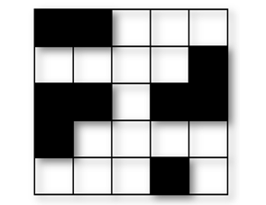

<br/><Br>

<span style = "color:orange">

# 어디에 단어가 들어갈 수 있을까
</span>
<br>

> 출처 : [어디에 단어가 들어갈 수 있을까](https://swexpertacademy.com/main/talk/solvingClub/problemView.do?contestProbId=AV5PuPq6AaQDFAUq&solveclubId=AYmbBU3a7cwDFAUe&problemBoxTitle=EXTRAS&problemBoxCnt=5&probBoxId=AYmbBnEa7eMDFAUe+)


<br/><br>

## 문제

> N X N 크기의 단어 퍼즐을 만들려고 한다. 입력으로 단어 퍼즐의 모양이 주어진다.

주어진 퍼즐 모양에서 특정 길이 K를 갖는 단어가 들어갈 수 있는 자리의 수를 출력하는 프로그램을 작성하라.

[예제]

N = 5, K = 3 이고, 퍼즐의 모양이 아래 그림과 같이 주어졌을 때



길이가 3 인 단어가 들어갈 수 있는 자리는 2 곳(가로 1번, 가로 4번)이 된다.

[제약 사항]

1. N은 5 이상 15 이하의 정수이다. (5 ≤ N ≤ 15)

2. K는 2 이상 N 이하의 정수이다. (2 ≤ K ≤ N)


[입력]

입력은 첫 줄에 총 테스트 케이스의 개수 T가 온다.

다음 줄부터 각 테스트 케이스가 주어진다.

테스트 케이스의 첫 번째 줄에는 단어 퍼즐의 가로, 세로 길이 N 과, 단어의 길이 K 가 주어진다.

테스트 케이스의 두 번째 줄부터 퍼즐의 모양이 2차원 정보로 주어진다.

퍼즐의 각 셀 중, 흰색 부분은 1, 검은색 부분은 0 으로 주어진다.


[출력]

테스트 케이스 t에 대한 결과는 “#t”을 찍고, 한 칸 띄고, 정답을 출력한다.

(t는 테스트 케이스의 번호를 의미하며 1부터 시작한다.)
<br/><br>

## 풀이

```python
   T = int(input())

# 테스트 케이스 시작
for tc in range(1, T+1):
    # 퍼즐의 크기, 단어의 길이
    zone_len, word_len = map(int, input().split())
    # 퍼즐의 모양
    zone = [list(map(int, input().split())) for _ in range(zone_len)]
    # 퍼즐의 겉을 0으로 둘러싸기 위해 2칸 더 확장
    new_zone = [[0] * (zone_len + 2) for _ in range(zone_len+2)]

    # 0으로 둘러싸인 new_zone의 모습
    for i in range(1, zone_len + 1):
        for j in range(1, zone_len + 1):
            new_zone[i][j] = zone[i-1][j-1]

    '''
    new_zone 기준으로 행을 확인하여 좌, 우측이 모두 0이고,
    1이 단어의 길이만큼 연속으로 나타나면 넣기 가능.
    '''
    # 단어 삽입이 가능한 경우의 수
    result = 0

    # new_zone에 접근(행 체크)
    for i in range(1, zone_len + 1):
        for j in range(1, zone_len + 1):
            # 연속됨을 확인하기 위해 cnt 변수 생성
            cnt = 0

            # 행 체크
            # 연속된 칸들에 들어있는 수가 모두 1임을 체크
            for k in range(0, word_len):

                # 범주 벗어나는지 체크
                if 1 <= j + word_len - 1 < zone_len + 1:
                    if new_zone[i][j+k] == 1:
                        cnt += 1

                    # 0이 나타나면 cnt를 초기화
                    else:
                        cnt = 0

            # cnt가 단어의 길이와 같아지면 좌, 우측에 0이 있는지 확인
            if cnt == word_len:
                if new_zone[i][j - 1] == new_zone[i][j + word_len] == 0:
                    result += 1
                    cnt = 0


    # new_zone에 접근 (열 체크)
    for i in range(1, zone_len + 1):
        for j in range(1, zone_len + 1):
            # 연속됨을 확인하기 위해 cnt 변수 생성
            cnt = 0

            # 열 체크
            # 연속된 칸들에 들어있는 수가 모두 1임을 체크
            for l in range(0, word_len):

                # 범주 벗어나는지 체크
                if 1 <= i + word_len - 1 < zone_len + 1:
                    if new_zone[i + l][j] == 1:
                        cnt += 1

                    # 0이 나타나면 cnt를 초기화
                    else:
                        cnt = 0

            # cnt가 단어의 길이와 같아지면 위, 아래에 0이 있는지 확인
            if cnt == word_len:
                if new_zone[i - 1][j] == new_zone[i + word_len][j] == 0:
                    result += 1
                    cnt = 0

    print(f"#{tc}", result)


 
```
<br>

> 해당 문제 풀이의 핵심은 조건을 줄이기 위해 원본의 배열을 0값을 채운 칸들로 둘러싼 배열을 다루었다는 것이다.  
> 원본의 배열에서 모든 변을 0으로 둘러싼 새로운 배열을 기준으로 문제에 접근한다.  
> 그 뒤 새로운 배열에서 각각 행과 열로 나누어 넣을 수 있는지 여부를 체크하는 구문을 작성했다.  
> 작성 가능여부를 체크할 때 인덱스를 벗어나지 않게 조건문으로 제한을 걸어두고, cnt변수가 단어의 길이와 같아지면, 작성 가능한 여부를 확실히 확인하기 위해 좌, 우 혹은 위, 아래에 0이 있는지 체크한다. 이 부분이 가장 핵심으로, 모서리 체크가 필요없이 단순히 0이 있는지 여부만을 체크하면 작성 가능 여부를 판정할 수 있다.

<br/><br>


## 의문점
> 해결되지 않은 부분


<br/><br>


## 배운점
> TIL

