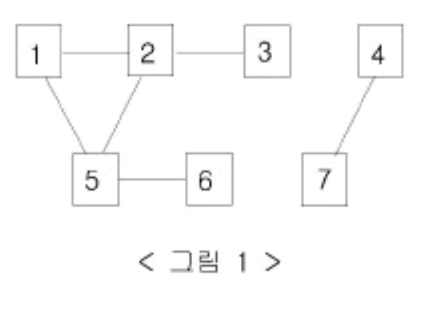

<br/><Br>

<span style = "color:orange">

# 문제 제목
바이러스


</span>
<br>

> 출처 : https://www.acmicpc.net/problem/2606


<br/><br>

## 문제

>
신종 바이러스인 웜 바이러스는 네트워크를 통해 전파된다. 

한 컴퓨터가 웜 바이러스에 걸리면 그 컴퓨터와 네트워크 상에서 연결되어 있는 모든 컴퓨터는 웜 바이러스에 걸리게 된다.

예를 들어 7대의 컴퓨터가 <그림 1>과 같이 네트워크 상에서 연결되어 있다고 하자. 1번 컴퓨터가 웜 바이러스에 걸리면 웜 바이러스는 2번과 5번 컴퓨터를 거쳐 3번과 6번 컴퓨터까지 전파되어 2, 3, 5, 6 네 대의 컴퓨터는 웜 바이러스에 걸리게 된다. 

하지만 4번과 7번 컴퓨터는 1번 컴퓨터와 네트워크상에서 연결되어 있지 않기 때문에 영향을 받지 않는다.


어느 날 1번 컴퓨터가 웜 바이러스에 걸렸다. 컴퓨터의 수와 네트워크 상에서 서로 연결되어 있는 정보가 주어질 때, 1번 컴퓨터를 통해 웜 바이러스에 걸리게 되는 컴퓨터의 수를 출력하는 프로그램을 작성하시오.
<br/><br>

## 풀이

```python
v = int(input())
e = int(input())
arr = [[0]*(v+1) for _ in range(v+1)]
stack = []
visited = [0] * (v+1)
# 길
route = []
# 바이러스는 양방향으로 전파
for _ in range(e):
    a, b = map(int, input().split())
    arr[a][b] = 1
    arr[b][a] = 1
# 방문 기록
n = 1
visited[n] = 1

while True:
    for w in range(v+1):
        if arr[n][w] == 1 and visited[w] == 0:
            #전진
            stack.append(n)
            n = w
            #방문 기록
            visited[n] = 1
            route.append(n)
            break
    else:
        # 후진
        if stack:
            n = stack.pop()
        else:
            break

print(len(route))
```
<br>

> 풀이설명


스택을 활용한 DFS 구현으로 풀었다

입력은 받은 상태 그대로 2차원 배열에 넣었다. 단, 바이러스 전파는 양방향이므로 인접 리스트 구현하는데 인덱스를 두번 할당했다

바이러스에 걸린 컴퓨터의 수 = DFS를 통한 루트의 길이와 같으므로

여기서는 [2,3,5,6]으로 4가 된다 
<br/><br>


## 의문점
> 해결되지 않은 부분


<br/><br>


## 배운점
> TIL

