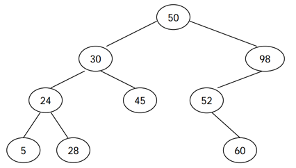

# 이진 검색 트리

> 출처 : [https://www.acmicpc.net/problem/5639](https://www.acmicpc.net/problem/5639)
> 

## 문제

이진 검색 트리는 다음과 같은 세 가지 조건을 만족하는 이진 트리이다.

노드의 왼쪽 서브트리에 있는 모든 노드의 키는 노드의 키보다 작다.
노드의 오른쪽 서브트리에 있는 모든 노드의 키는 노드의 키보다 크다.
왼쪽, 오른쪽 서브트리도 이진 검색 트리이다. 
<br>


<Br>

전위 순회 (루트-왼쪽-오른쪽)은 루트를 방문하고, 왼쪽 서브트리, 오른쪽 서브 트리를 순서대로 방문하면서 노드의 키를 출력한다. 후위 순회 (왼쪽-오른쪽-루트)는 왼쪽 서브트리, 오른쪽 서브트리, 루트 노드 순서대로 키를 출력한다. 예를 들어, 위의 이진 검색 트리의 전위 순회 결과는 50 30 24 5 28 45 98 52 60 이고, 후위 순회 결과는 5 28 24 45 30 60 52 98 50 이다.

이진 검색 트리를 전위 순회한 결과가 주어졌을 때, 이 트리를 후위 순회한 결과를 구하는 프로그램을 작성하시오.
## 풀이

```python
import sys
sys.setrecursionlimit(10**9)
nums = []
while True:                            
    try:
        nums.append(int(sys.stdin.readline()))
    except:
        break
        
def postorder(s, e):
    if s > e:
        return
    mid = e + 1                         # 오른쪽 노드가 없을 경우

    for i in range(s+1, e+1):
        if nums[s] < nums[i]:
            mid = i
            break

    postorder(s+1, mid-1)               # 왼쪽 확인
    postorder(mid, e)                   # 오른쪽 확인
    print(nums[s])

postorder(0, len(nums)-1)
```

> 해결하지 못해 블로그를 참고했음  
>
> 시작지점, 끝 지점에서 서서히 좁혀가며 이진 탐색을 수행하며, 중간값은 끝에서부터 서서히 찾고 있다.
> 

## 의문점

## 배운점

> TIL
>