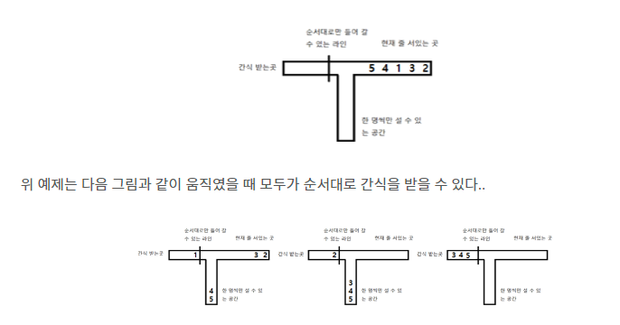

# TIL양식

# 도키도키 간식드리미

> 출처 : [https://www.acmicpc.net/problem/12789)
> 

## 문제

>  인하대학교 학생회에서는 중간, 기말고사 때마다 시험 공부에 지친 학우들을 위해 간식을 나눠주는 간식 드리미 행사를 실시한다. 승환이는 시험 기간이 될 때마다 간식을 받을 생각에 두근두근 설레서 시험 공부에 집중을 못 한다. 이번 중간고사에서도 역시 승환이는 설레는 가슴을 안고 간식을 받기 위해 미리 공지된 장소에 시간 맞춰 도착했다. 그런데 이게 무슨 날벼락인가! 그 곳에는 이미 모든 학생들이 모여있었고, 승환이는 마지막 번호표를 받게 되었다. 설상가상으로 몇몇 양심에 털이 난 학생들이 새치기를 거듭한 끝에 대기열의 순서마저 엉망이 되고 말았다. 간식을 나눠주고 있던 인규는 학우들의 터져 나오는 불만에 번호표 순서로만 간식을 줄 수 있다고 말했다. 

>그제야 학생들이 순서대로 줄을 서려고 했지만 공간이 너무 협소해서 마음대로 이동할 수 없었다. 다행히도 대기열의 왼쪽에는 1열로 설 수 있는 공간이 존재하여 이 공간을 잘 이용하면 모두가 순서대로 간식을 받을 수 있을지도 모른다. 자칫 간식을 못 받게 될지도 모른다는 위기감을 느낀 승환이는 자신의 컴퓨터 알고리즘적 지식을 활용해 과연 모든 사람들이 순서대로 간식을 받을 수 있는지 확인하는 프로그램을 만들기로 했다. 만약 불가능 하다면 승환이는 이번 중간고사를 망치게 될 것 이고 가능하다면 힘을 얻어 중간고사를 잘 볼 수 있을지도 모른다.

>사람들은 현재 1열로 줄을 서있고, 맨 앞의 사람만 이동이 가능하다. 인규는 번호표 순서대로만 통과할 수 있는 라인을 만들어 두었다. 이 라인과 대기열의 맨 앞 사람 사이에는 한 사람씩 1열이 들어갈 수 있는 공간이 있다. 현재 대기열의 사람들은 이 공간으로 올 수 있지만 반대는 불가능하다. 승환이를 도와 프로그램을 완성하라.

>현재 간식 배부 공간을 그림으로 나타내면 다음과 같다.

<br>



<br>

## 풀이

```python
T = int(input())
for tc in range(1, T+1):
    s = input().strip() # 괄호 문자열
    cnt = 0  # 겹쳐진 쇠 막대기의 수
    ans = 0  # 답
    flag = False  # 레이져인지 판단하기 위한 플래그
    for c in s:
        # '('가 나오면 쇠 막대기가 하나 추가 된다.
        if c == '(':
            cnt += 1
            flag = True
        else:
            # 레이져이면 쇠 막대기의 갯수를 맞추기 위해 아니면 쇠 막대기가 하나 감소하므로 1 감소
            cnt -= 1
            if flag:  # 레이져이면 쇠 막대기 수만 큼 조각이 나온다.
                ans += cnt
            else:  # 쇠막대기의 끝 부분이면 그 막대기의 조각 하나가 나온다.
                ans += 1
            flag = False

    print(f'#{tc} {ans}')
```

 

## 의문점

## 배운점

> TIL
>