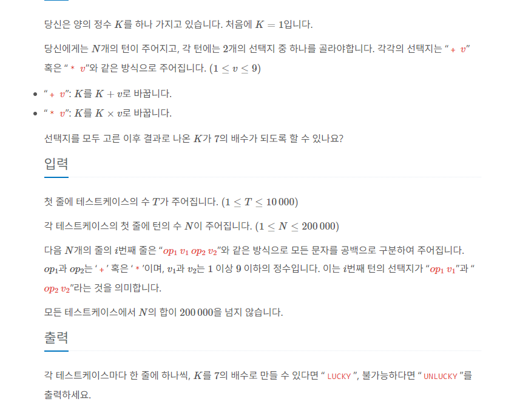

<br/><Br>

<span style = "color:orange">

# 럭키세븐
</span>
<br>

> 출처 : [28706](https://github.com/wtasdwerf/algostudy/blob/master/202309/20230912/%EB%AC%B8%EC%A0%9C/%EA%B9%80%EB%B2%94%EC%88%98_%EB%9F%AD%ED%82%A4_%EC%84%B8%EB%B8%90.md)


<br/><br>

## 문제

> 

<br/><br>

## 풀이

```python
   import sys
input = sys.stdin.readline


'''
1. 모든 연산을 적용하여 7의 배수가 되는지가 관건 => 단순 백트래킹으로 구현시 시간복잡도 n^2으로 해결불가
2. 블로그 내의 dp 참고. 
    동작 원리
    - calculate 함수에서 명령대로 연산을 한뒤, 7로 나누어 나머지를 확인해보는 추가 연산을 진행.
    그리고 나머지만을 temp에 set로 저장하여 다음 연산을 진행 => 원본의 수의 형태가 어떤지 중요한지 않음.(전혀 고려하지 않아도 되는 상황)
    - 추가 연산을 진행하는 이유?
        =>  7의 나머지만을 set로 저장하여 연산횟수를 더 줄일 수 있고, 
        단순 for문만을 활용하여 최대 20만번의 연산 * 7로 나누었을 때 나머지의 개수는 최대 7개이므로 최악의 경우에도
        140만번의 연산으로 결과를 도출 가능.
'''


def calculate(command, dp_set):
    temp = set()
    for i in range(0, 4, 2):
        oper, num = command[i], command[i + 1]
        for operand in dp_set:
            if oper == "+":
                temp.add((operand + int(num)) % 7)
            else:
                temp.add((operand * int(num)) % 7)
    return temp


T = int(input())
for _ in range(T):
    N = int(input())    # 명령 수
    commands = [list(map(str, input().split())) for _ in range(N)]   # 각 명령들
    dp_set = set([1])  # 1부터 시작
    for command in commands:
        dp_set = calculate(command, dp_set)

    if 0 in dp_set:
        print("LUCKY")
    else:
        print("UNLUCKY")
```
<br>

> 풀이설명

<br/><br>


## 의문점
> 해결되지 않은 부분


<br/><br>


## 배운점
> TIL

